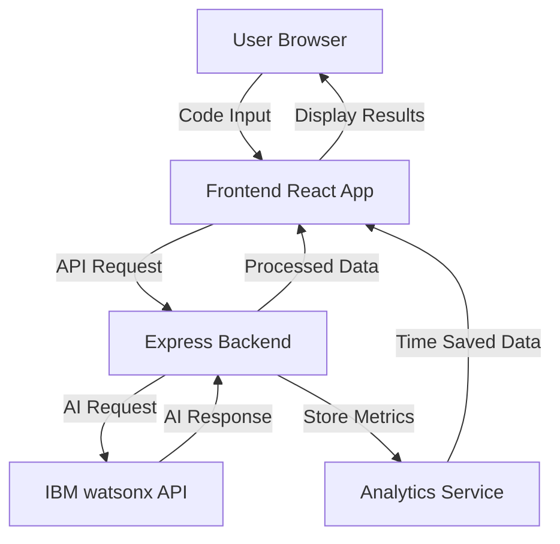

# Dev Buddy - Comprehensive Development Plan

## Executive Summary

**Dev Buddy** is a web application that uses IBM watsonx to instantly explain code, generate tests, and create documentation with one click. It addresses the critical pain point of developers spending 2+ hours daily trying to understand unfamiliar code.

### Hackathon Judging Criteria Alignment

1. **Innovation** ✓ First one-click solution for comprehensive code understanding
2. **Technical Implementation** ✓ IBM watsonx AI integration with real-time processing
3. **Impact** ✓ Measurable time savings (2+ hours/developer/day)
4. **Presentation** ✓ Simple demo with clear before/after metrics

---

## System Architecture



### Technology Stack

**Frontend:**
- React.js with Hooks
- Monaco Editor (VS Code's editor component)
- Tailwind CSS for styling
- Chart.js for analytics visualization
- Axios for API calls

**Backend:**
- Node.js with Express.js
- IBM watsonx SDK
- CORS enabled
- Environment variable management
- Rate limiting and error handling

**AI Integration:**
- IBM watsonx.ai for code analysis
- Custom prompts for each feature
- Response parsing and formatting

---

## Feature Specifications

### 1. Code Explanation
**Input:** Any code snippet (any language)
**Output:** 
- Plain English explanation
- Line-by-line breakdown
- Key concepts identified
- Complexity analysis
**Time Saved:** ~30-45 minutes per code review

### 2. Test Generation
**Input:** Function or class code
**Output:**
- Unit tests in appropriate framework
- Edge cases covered
- Mock data examples
- Test coverage suggestions
**Time Saved:** ~45-60 minutes per function

### 3. Documentation Generation
**Input:** Code module or function
**Output:**
- JSDoc/Docstring format
- Parameter descriptions
- Return value documentation
- Usage examples
**Time Saved:** ~20-30 minutes per module

### 4. Time-Tracking Analytics
**Metrics Tracked:**
- Total time saved per session
- Number of code snippets analyzed
- Most used feature
- Average time saved per operation
- Cumulative team savings

---

## Implementation Phases

### Phase 1: IBM watsonx Setup (Priority: CRITICAL)

**Steps to Get API Access:**

1. **Sign up for IBM Cloud Account**
   - Visit: https://cloud.ibm.com/registration
   - Use your email to create free account
   - Verify email address

2. **Create watsonx.ai Instance**
   - Navigate to IBM Cloud Catalog
   - Search for "watsonx.ai"
   - Select the Lite/Trial plan (free tier)
   - Create service instance

3. **Get API Credentials**
   - Go to watsonx.ai dashboard
   - Navigate to "Service Credentials"
   - Create new credentials
   - Copy: API Key, Project ID, and URL

4. **Test API Connection**
   - Use provided credentials
   - Make test API call
   - Verify response format

**Configuration Required:**
```env
WATSONX_API_KEY=your_api_key_here
WATSONX_PROJECT_ID=your_project_id_here
WATSONX_URL=https://us-south.ml.cloud.ibm.com
```

### Phase 2: Backend Development

**File Structure:**
```
backend/
├── server.js                 # Main Express server
├── config/
│   └── watsonx.config.js    # IBM watsonx configuration
├── services/
│   ├── watsonx.service.js   # AI integration logic
│   └── analytics.service.js # Time tracking
├── routes/
│   ├── explain.route.js     # Code explanation endpoint
│   ├── test.route.js        # Test generation endpoint
│   └── docs.route.js        # Documentation endpoint
├── utils/
│   ├── prompts.js           # AI prompt templates
│   └── parser.js            # Response parsing
├── middleware/
│   ├── errorHandler.js      # Error handling
│   └── rateLimiter.js       # Rate limiting
└── .env                      # Environment variables
```

**API Endpoints:**
- `POST /api/explain` - Explain code
- `POST /api/generate-tests` - Generate tests
- `POST /api/generate-docs` - Generate documentation
- `GET /api/analytics` - Get time-saved metrics

### Phase 3: Frontend Development

**File Structure:**
```
frontend/
├── public/
│   └── index.html
├── src/
│   ├── App.js                    # Main app component
│   ├── components/
│   │   ├── CodeEditor.jsx        # Monaco editor wrapper
│   │   ├── ResultsPanel.jsx      # Display AI results
│   │   ├── FeatureButtons.jsx    # Action buttons
│   │   ├── Analytics.jsx         # Time-saved dashboard
│   │   └── LoadingSpinner.jsx    # Loading states
│   ├── services/
│   │   └── api.service.js        # API calls
│   ├── utils/
│   │   └── timeCalculator.js     # Time savings logic
│   └── styles/
│       └── tailwind.css          # Styling
└── package.json
```

**UI/UX Design:**
- Clean, modern interface
- Split-screen layout (code input | results)
- One-click action buttons
- Real-time time-saved counter
- Syntax highlighting for all languages
- Copy-to-clipboard functionality

### Phase 4: AI Integration

**Prompt Engineering Strategy:**

**Code Explanation Prompt:**
```
Analyze this code and provide:
1. High-level overview in plain English
2. Line-by-line explanation
3. Key concepts and patterns used
4. Potential issues or improvements
5. Complexity analysis

Code:
{user_code}

Language: {detected_language}
```

**Test Generation Prompt:**
```
Generate comprehensive unit tests for this code:
1. Use appropriate testing framework for {language}
2. Cover happy path scenarios
3. Include edge cases
4. Add mock data where needed
5. Ensure 80%+ code coverage

Code:
{user_code}
```

**Documentation Prompt:**
```
Generate professional documentation:
1. Use standard format (JSDoc/Docstring/etc)
2. Describe all parameters and return values
3. Include usage examples
4. Add notes about complexity or dependencies

Code:
{user_code}
```

### Phase 5: Analytics & Time Tracking

**Time Calculation Logic:**
```javascript
const TIME_SAVED_ESTIMATES = {
  explain: 35,      // minutes
  tests: 50,        // minutes
  documentation: 25 // minutes
};

function calculateTimeSaved(feature, codeLength) {
  const baseTime = TIME_SAVED_ESTIMATES[feature];
  const complexityMultiplier = codeLength > 100 ? 1.5 : 1.0;
  return Math.round(baseTime * complexityMultiplier);
}
```

**Metrics Dashboard:**
- Total time saved (today, this week, all time)
- Number of operations performed
- Most popular feature
- Average code snippet size
- Team impact calculator (multiply by team size)

### Phase 6: Demo Preparation

**Demo Script:**
1. **Problem Statement** (30 seconds)
   - Show complex code snippet
   - "This would take 45 minutes to understand manually"

2. **Solution Demo** (2 minutes)
   - Paste code into Dev Buddy
   - Click "Explain Code" → instant results
   - Click "Generate Tests" → instant tests
   - Click "Generate Docs" → instant documentation
   - Show time-saved counter: "Saved 45 minutes"

3. **Impact Showcase** (30 seconds)
   - Analytics dashboard
   - "For a team of 10: 20 hours saved per day"
   - "That's $50,000+ in productivity gains per year"

**Sample Code for Demo:**
```javascript
// Complex React Hook example
function useDebounce(value, delay) {
  const [debouncedValue, setDebouncedValue] = useState(value);
  useEffect(() => {
    const handler = setTimeout(() => {
      setDebouncedValue(value);
    }, delay);
    return () => clearTimeout(handler);
  }, [value, delay]);
  return debouncedValue;
}
```

---

## Development Timeline

**Total Estimated Time: 12-16 hours**

| Phase | Tasks | Time | Priority |
|-------|-------|------|----------|
| 1 | IBM watsonx setup | 1-2 hours | CRITICAL |
| 2 | Backend API | 3-4 hours | HIGH |
| 3 | Frontend UI | 4-5 hours | HIGH |
| 4 | AI Integration | 2-3 hours | HIGH |
| 5 | Analytics | 1-2 hours | MEDIUM |
| 6 | Testing & Demo | 1-2 hours | HIGH |

---

## Risk Mitigation

### Risk 1: IBM watsonx API Access Delays
**Mitigation:** 
- Start API setup immediately
- Have mock responses ready for development
- Use fallback to OpenAI API if needed

### Risk 2: API Rate Limits
**Mitigation:**
- Implement request caching
- Add rate limiting on frontend
- Use efficient prompts to minimize tokens

### Risk 3: Complex Code Parsing
**Mitigation:**
- Support major languages first (JS, Python, Java)
- Add language detection
- Graceful error handling

---

## Success Metrics

**Technical:**
- ✓ All 3 features working (explain, test, docs)
- ✓ Response time < 5 seconds
- ✓ Support for 5+ programming languages
- ✓ 95%+ uptime during demo

**Business:**
- ✓ Clear time-saved calculation
- ✓ Measurable impact demonstration
- ✓ Professional UI/UX
- ✓ Compelling demo narrative

---

## Post-Hackathon Roadmap

**V2 Features:**
- VS Code extension
- GitHub integration
- Team collaboration features
- Code refactoring suggestions
- Security vulnerability detection
- Multi-file analysis
- Custom AI model training

---

## Resources & Links

**IBM watsonx:**
- Documentation: https://www.ibm.com/docs/en/watsonx-as-a-service
- API Reference: https://cloud.ibm.com/apidocs/watsonx-ai
- Getting Started: https://www.ibm.com/watsonx

**Development Tools:**
- Monaco Editor: https://microsoft.github.io/monaco-editor/
- React Documentation: https://react.dev/
- Express.js Guide: https://expressjs.com/

**Deployment:**
- Frontend: Vercel/Netlify
- Backend: Heroku/Railway
- Environment: Node.js 18+

---

## Next Steps

1. **Immediate Action:** Set up IBM watsonx API access
2. **Day 1:** Complete backend infrastructure
3. **Day 2:** Build frontend and integrate AI
4. **Day 3:** Testing, analytics, and demo prep

**Ready to start building? Let's switch to Code mode to implement this plan!**