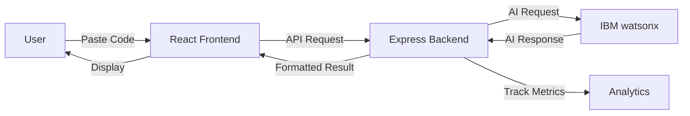

# 🤖 Dev Buddy - AI-Powered Code Understanding Assistant

> **Hackathon Project**: Instantly understand any code with IBM watsonx AI - Save 2+ hours per developer per day

[](https://www.ibm.com/watsonx)
[](https://opensource.org/licenses/MIT)
[](https://nodejs.org/)
[](https://reactjs.org/)

---

## 🎯 The Problem

Junior developers waste **2+ hours every day** trying to understand code written by others. There's no quick way to get comprehensive explanations, tests, or documentation for unfamiliar code.

## 💡 The Solution

**Dev Buddy** uses IBM watsonx AI to instantly:
- ✨ **Explain** any code in plain English
- 🧪 **Generate** comprehensive unit tests
- 📝 **Create** professional documentation

All with **one click**.

## 📊 The Impact

- **Individual**: Save 2+ hours per developer per day
- **Team of 10**: Save 20 hours per day
- **Annual Value**: $450,000+ in productivity gains

---

## 🚀 Quick Start

### Prerequisites

- Node.js 18+ installed
- IBM Cloud account (free tier)
- IBM watsonx API credentials

### 1. Clone the Repository

```bash
git clone https://github.com/yourusername/dev-buddy.git
cd dev-buddy
```

### 2. Set Up IBM watsonx API

Follow the detailed guide: [`IBM_WATSONX_SETUP_GUIDE.md`](./IBM_WATSONX_SETUP_GUIDE.md)

**Quick Steps:**
1. Create IBM Cloud account: https://cloud.ibm.com/registration
2. Create watsonx.ai instance (free tier)
3. Get API credentials
4. Copy credentials to `.env` file

### 3. Install Dependencies

```bash
# Backend
cd backend
npm install

# Frontend
cd ../frontend
npm install
```

### 4. Configure Environment

Create `backend/.env`:

```env
WATSONX_API_KEY=your_api_key_here
WATSONX_PROJECT_ID=your_project_id_here
WATSONX_URL=https://us-south.ml.cloud.ibm.com
WATSONX_MODEL_ID=ibm/granite-13b-chat-v2
PORT=3001
FRONTEND_URL=http://localhost:3000
```

### 5. Run the Application

```bash
# Terminal 1 - Backend
cd backend
npm start

# Terminal 2 - Frontend
cd frontend
npm start
```

Visit: http://localhost:3000

---

## 🎬 Demo

### Live Demo Flow

1. **Paste Complex Code** → Any language, any framework
2. **Click "Explain Code"** → Get instant plain English explanation
3. **Click "Generate Tests"** → Get comprehensive unit tests
4. **Click "Generate Docs"** → Get professional documentation
5. **See Time Saved** → "Saved you 45 minutes!"

### Sample Code for Demo

```javascript
// Complex React Hook - Perfect for demo
function useDebounce(value, delay) {
  const [debouncedValue, setDebouncedValue] = useState(value);
  useEffect(() => {
    const handler = setTimeout(() => {
      setDebouncedValue(value);
    }, delay);
    return () => clearTimeout(handler);
  }, [value, delay]);
  return debouncedValue;
}
```

**Result**: Instant explanation + tests + docs in under 5 seconds!

---

## 🏗️ Architecture



### Tech Stack

**Frontend:**
- React 18 with Hooks
- Monaco Editor (VS Code's editor)
- Tailwind CSS
- Axios for API calls

**Backend:**
- Node.js + Express
- IBM watsonx SDK
- CORS enabled
- Rate limiting

**AI:**
- IBM watsonx.ai
- Granite 13B Chat model
- Custom prompt engineering

---

## 📁 Project Structure

```
dev-buddy/
├── backend/
│   ├── server.js              # Express server
│   ├── config/
│   │   └── watsonx.config.js  # IBM watsonx setup
│   ├── services/
│   │   ├── watsonx.service.js # AI integration
│   │   └── analytics.service.js
│   ├── routes/
│   │   ├── explain.route.js
│   │   ├── test.route.js
│   │   └── docs.route.js
│   └── package.json
├── frontend/
│   ├── src/
│   │   ├── App.js
│   │   ├── components/
│   │   │   ├── CodeEditor.jsx
│   │   │   ├── ResultsPanel.jsx
│   │   │   └── Analytics.jsx
│   │   └── services/
│   │       └── api.service.js
│   └── package.json
├── DEVELOPMENT_PLAN.md        # Comprehensive plan
├── TECHNICAL_SPECIFICATIONS.md # API specs & details
├── IBM_WATSONX_SETUP_GUIDE.md # API setup guide
└── README.md                   # This file
```

---

## 🎯 Features

### 1. Code Explanation
- Plain English overview
- Line-by-line breakdown
- Key concepts identified
- Complexity analysis
- Improvement suggestions

### 2. Test Generation
- Framework-specific tests (Jest, PyTest, JUnit, etc.)
- Happy path scenarios
- Edge cases
- Error handling
- Mock data examples

### 3. Documentation Generation
- Standard format (JSDoc, Docstring, etc.)
- Parameter descriptions
- Return value documentation
- Usage examples
- Complexity notes

### 4. Time-Tracking Analytics
- Real-time time-saved counter
- Operation history
- Team impact calculator
- Visual analytics dashboard

---

## 🔧 API Endpoints

### POST /api/explain
Explain code in plain English

**Request:**
```json
{
  "code": "function add(a, b) { return a + b; }",
  "language": "javascript"
}
```

**Response:**
```json
{
  "success": true,
  "data": {
    "explanation": { ... },
    "timeSaved": 35
  }
}
```

### POST /api/generate-tests
Generate unit tests

### POST /api/generate-docs
Generate documentation

### GET /api/analytics
Get time-saved metrics

See [`TECHNICAL_SPECIFICATIONS.md`](./TECHNICAL_SPECIFICATIONS.md) for complete API documentation.

---

## 🎨 Screenshots

### Main Interface
```
┌─────────────────────────────────────────────────────────┐
│  Dev Buddy 🤖                    Time Saved: 45 min     │
├─────────────────────────────────────────────────────────┤
│                                                          │
│  Code Editor                │  Results Panel            │
│  ┌──────────────────┐       │  ┌──────────────────┐    │
│  │ function add(a,b)│       │  │ Explanation:     │    │
│  │ { return a + b; }│       │  │ This function... │    │
│  │                  │       │  │                  │    │
│  └──────────────────┘       │  └──────────────────┘    │
│                                                          │
│  [Explain] [Tests] [Docs]                               │
│                                                          │
└─────────────────────────────────────────────────────────┘
```

---

## 📈 Hackathon Judging Criteria

### ✅ Innovation
- **First** one-click solution for comprehensive code understanding
- Combines explanation + tests + docs in single platform
- Real-time time-saved tracking

### ✅ Technical Implementation
- IBM watsonx AI integration
- Custom prompt engineering
- Real-time processing
- Professional UI/UX

### ✅ Impact
- **Measurable**: 2+ hours saved per developer per day
- **Scalable**: Works for any language, any framework
- **Quantifiable**: $450K+ annual value for team of 10

### ✅ Presentation
- Simple, clear demo
- Before/after comparison
- Live time-saved counter
- Professional interface

---

## 🧪 Testing

### Run Backend Tests
```bash
cd backend
npm test
```

### Run Frontend Tests
```bash
cd frontend
npm test
```

### Manual Testing Checklist
- [ ] Code explanation works for JavaScript
- [ ] Code explanation works for Python
- [ ] Test generation produces valid tests
- [ ] Documentation follows standard format
- [ ] Time-saved counter updates correctly
- [ ] Error handling works properly
- [ ] Analytics dashboard displays correctly

---

## 🚀 Deployment

### Backend (Heroku)

```bash
cd backend
heroku create dev-buddy-api
heroku config:set WATSONX_API_KEY=your_key
heroku config:set WATSONX_PROJECT_ID=your_project_id
git push heroku main
```

### Frontend (Vercel)

```bash
cd frontend
vercel --prod
```

See [`DEVELOPMENT_PLAN.md`](./DEVELOPMENT_PLAN.md) for detailed deployment instructions.

---

## 📚 Documentation

- **[Development Plan](./DEVELOPMENT_PLAN.md)** - Complete implementation roadmap
- **[Technical Specifications](./TECHNICAL_SPECIFICATIONS.md)** - API specs and architecture
- **[IBM watsonx Setup Guide](./IBM_WATSONX_SETUP_GUIDE.md)** - Step-by-step API setup

---

## 🤝 Contributing

This is a hackathon project, but contributions are welcome!

1. Fork the repository
2. Create your feature branch (`git checkout -b feature/AmazingFeature`)
3. Commit your changes (`git commit -m 'Add some AmazingFeature'`)
4. Push to the branch (`git push origin feature/AmazingFeature`)
5. Open a Pull Request

---

## 📝 License

This project is licensed under the MIT License - see the [LICENSE](LICENSE) file for details.

---

## 🙏 Acknowledgments

- **IBM watsonx** for providing the AI capabilities
- **Monaco Editor** for the code editor component
- **React** and **Express** communities
- All developers who struggle with understanding code daily

---

## 📞 Contact

**Project Maintainer**: Your Name
- Email: your.email@example.com
- GitHub: [@yourusername](https://github.com/yourusername)
- LinkedIn: [Your Name](https://linkedin.com/in/yourname)

**Project Link**: https://github.com/yourusername/dev-buddy

---

## 🎯 Hackathon Pitch

> "Every developer has struggled to understand someone else's code. Dev Buddy solves that with one click, powered by IBM watsonx. It's simple to demo, simple to understand, and has clear, measurable impact: **'Saved you 45 minutes'**."

**Problem**: 2+ hours wasted daily understanding code  
**Solution**: One-click AI-powered explanation, tests, and docs  
**Impact**: $450K+ annual savings for a team of 10  

---

<div align="center">

**Built with ❤️ for developers, by developers**

[Get Started](#-quick-start) • [View Demo](#-demo) • [Read Docs](./DEVELOPMENT_PLAN.md)

</div>